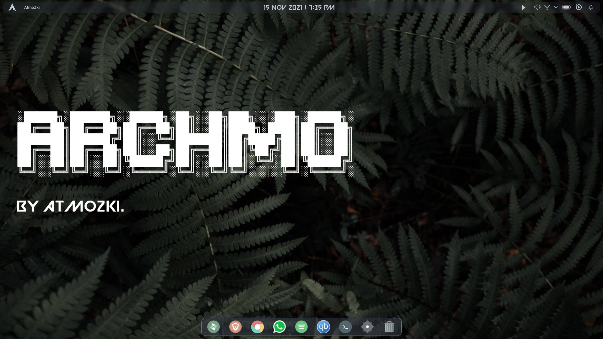

# ArchMO Installer Script
Script to personalize Arch my way.




This README contains the applist and steps I do to configure a fully-functional Arch(btw) Linux installation with KDE PLASMA, all the support packages (network, bluetooth, audio, printers, etc.., along with all my preferred applications and utilities. The shell scrips in this repo allow the entire process to be automated)


---
## Create ArchLinux GUI ISO or Use Image

Download ArchLinux GUI ISO from <https://archlinuxgui.in/download.html> and put on a USB drive with Rufus with DD


## Boot Arch ISO

From initial Prompt type the following commands:

```
pacman -Sy git
git clone https://github.com/atmozki/ArchMO.git
cd ArchMO
./archmo.sh
```

### System Description

This is completely automated arch install of the KDE desktop environment on arch using all the packages I use on a daily basis. 


## Troubleshooting

__[Arch Linux Installation Guide](https://github.com/rickellis/Arch-Linux-Install-Guide)__.

### No Wifi

#1: Run `iwctl`

#2: Run `device list`, and find your device name.

#3: Run `station [device name] scan`

#4: Run `station [device name] get-networks`

#5: Find your network, and run `station [device name] connect [network name]`, enter your password and run `exit`. You can test if you have internet connection by running `ping google.com`. 

## Credits

- Chris Titus's **[ARCHTITUS](https://github.com/ChrisTitusTech/ArchTitus.git)**.